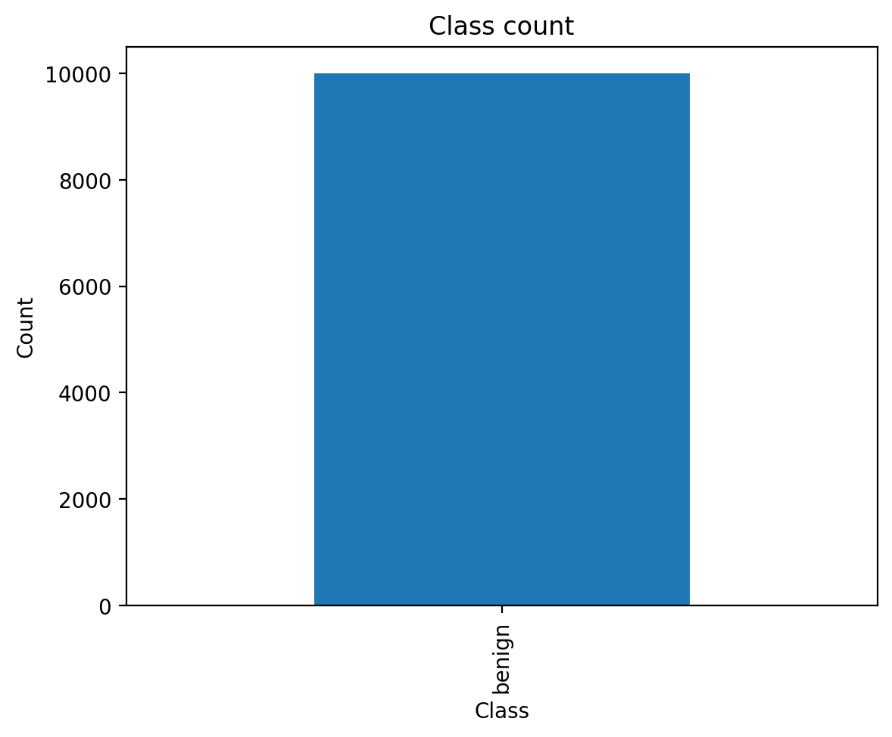
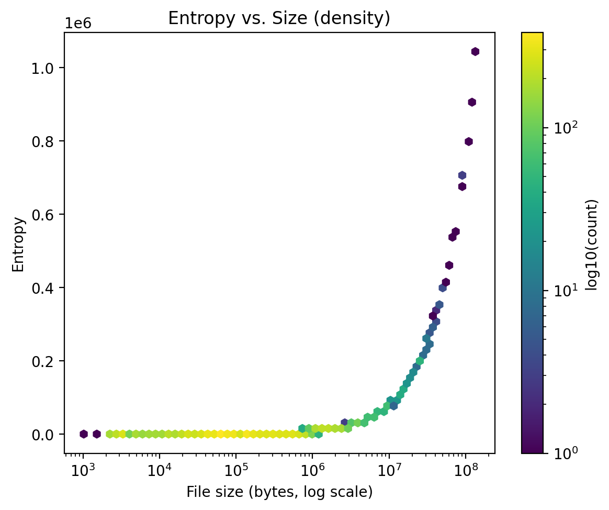

# Dataset Exploration (EMBER features) - Sample of dataset

## Class distribution
  
**What it shows:** This sample is heavily **benign-skewed** (no malicious rows visible), so the data is **class-imbalanced**. Need more shards or balancing before modeling.

## Entropy vs. Size
  
**What it shows:** Most files are smaller with lower entropy; as size grows, some samples show **higher entropy** (often packed/compressed). This pair is informative for downstream features/rules.

